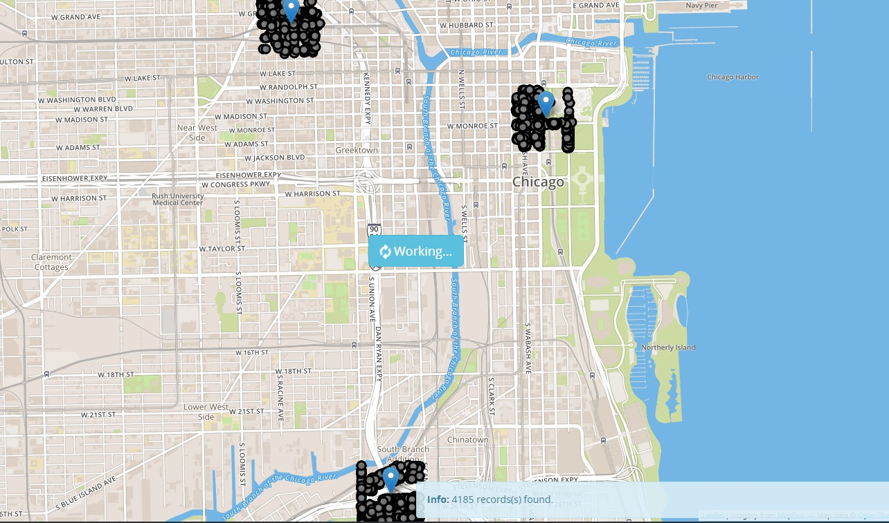
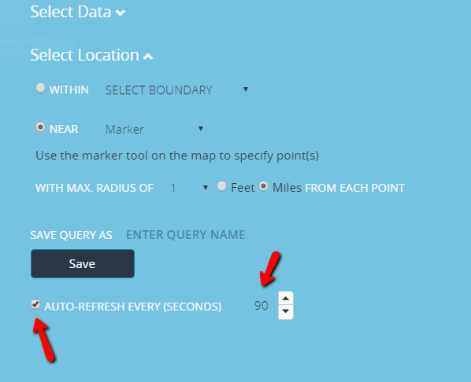

Auto refresh is an optional feature within the application that can be applied to a search. 
The refresh component is used for monitoring, performance, or updates related to data. &nbsp; Auto-refresh keeps the map in sync with tha latest data while the map is open.

When active, it refreshes in intervals of seconds (default is 30 seconds and maximum of 3600 seconds (60 minutes)); it refreshes and replots the latest data on the map whether its using the application on a desktop or mobile device.

<b>Auto-refresh example using markers on a map.</b>

As the map continues to refresh, three things can occur since the initial load:

* A message appears if the search times out.
* A message appears if new data is available displaying the new count.
* The screen remains static if no new content has been made available.

### Steps to auto refresh
To enable auto-refresh of your data and base map, in
the Find Data panel -> go the auto refresh section.
Check the box <b>“Auto-Refresh Every (SECONDS)”</b>. &nbsp;
Select the number of seconds required for desired auto-refresh
by using the increment/decrement counter or enter the number
of seconds in the auto-refresh textbox. &nbsp; Select "Get Data". 

