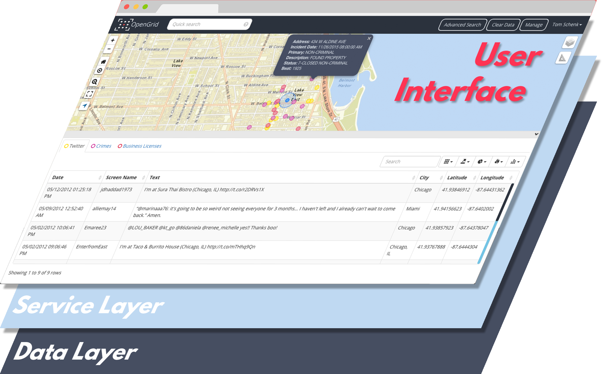

# Application Architecture

OpenGrid consists of a user interface layer that is seen by the user in the web browser and a service layer. The service layer is responsible for interpreting commands from the user interface to an underlying data layer. In turn, the user interface communicates with the service layer through an [Application Programmer Interface (API)](http://docs.opengrid.io/en/latest/OpenGrid%20API/). 

The service layer share the same API to communicate with the user interface, but are compatible with different data store engines. This approach will make it easier to maintain a consistent user interface, but allow it to be compatible with different databases and APIs as these tend to change or different data storage engines often change over time.

OpenGrid is compatible with [MongoDB](https://www.mongodb.com) or [Plenario](http://www.plenar.io). MongoDB's service layer was created by the City of Chicago and [available in this repository](https://www.github.com/Chicago/opengrid-svc-template). The service layer for Plenario was created by Smart Chicago Collaborative and [available here](https://github.com/smartchicago/opengrid-svc-plenario).

## MongoDB or Plenario?

MongoDB is a flexible, JSON-based data engine that lets you easily store data with minimal concerns about designing a schema. Plenario is a storage engine which quickly and easily stores open data from [Socrata](https://www.socrata.com), such as [City of Chicago](https://data.cityofchicago.org), or CKAN like the [U.S. government](http://catalog.data.gov/dataset) data portals. Plenario makes all of these data available through a simple API.

MongoDB is a great solution for on-site deployments or when using data not readily available on Socrata or CKAN. It is an open-source, supurbly documented database that can be installed on-site and behind a firewall. The City of Chicago, for instance, uses OpenGrid + MongoDB to power an internal version of OpenGrid, dubbed [WindyGrid](http://datasmart.ash.harvard.edu/news/article/chicagos-windygrid-taking-situational-awareness-to-a-new-level-259), that loads data from internal systems.

Plenario quickly ingests data from popular open data portal platforms, Socrata and CKAN. But it is more difficult to upload data from other sources, such as databases. Therefore, pairing OpenGrid with Plenario (with the corresponding service layer) works great to visualize open data. Adding data from an open data portal is simple, see [Plenario's documentation for adding a data set](http://plenar.io/add). An example of OpenGrid + Plenario can be seen at [https://chicago.opengrid.io](https://chicago.opengrid.io). 

## Plenar.io test service layer

A publicly-available instance of the Plenar.io service layer is at [http://opengrid-service-dev-1134290206.us-west-2.elb.amazonaws.com/opengrid-service/](http://opengrid-service-dev-1134290206.us-west-2.elb.amazonaws.com/opengrid-service/)

Use this end-point to test any changes you have made to the OpenGrid application that relies on Plenario, but does not require the setup of the service layer.

## Links

* [OpenGrid user interface repo](https://github.com/Chicago/opengrid)
* [OpenGrid Serivce layer API](../system-administration/OpenGrid-API/)
* [MongoDB-compatible service layer repo](https://github.com/Chicago/opengrid-svc-layer)
* [Plenario service layer repo](https://github.com/smartchicago/opengrid-svc-plenario)
* [Plenario serice layer development end-point](http://opengrid-service-dev-1134290206.us-west-2.elb.amazonaws.com/opengrid-service/)
